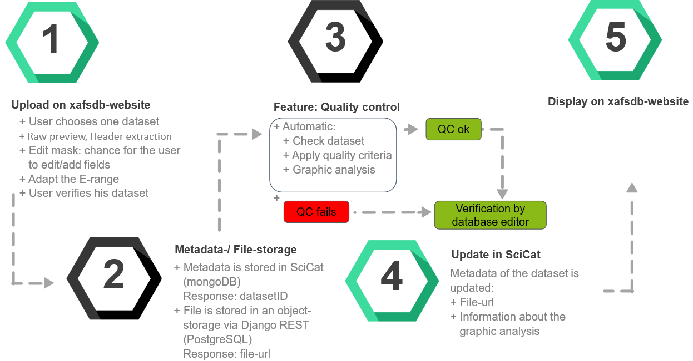

<link rel="stylesheet" href="/css/custom.css">

# XAFSDB 4 DAPHNE

[Authors](#authors) 
[Overview](#overview) 
[Flowchart](#flowchart) 
[Disclaimer](#disclaimer) 

## Authors
[Sebastian Paripsa](mailto:paripsa@uni-wuppertal.de) (Bergische Universitaet Wuppertal), 
[Abhijeet Gaur](mailto:abhijeet.gaur@kit.edu) (Karlsruhe Institute of Technology), 
[Frank Förste](mailto:ffoerste@physik.tu-berlin.de) (Technische Universitaet Berlin), 
[Dmitry Doronkin](mailto:dmitry.doronkin@kit.edu) (Karlsruhe Institute of Technology), 
[Jan-Dierk Grunwaldt](mailto:grunwaldt@kit.edu) (Karlsruhe Institute of Technology), 
[Dirk Lützenkirchen-Hecht](mailto:dirklh@uni-wuppertal.de) (Bergische Universitaet Wuppertal), 
[Wolfgang Malzer](mailto:wolfgang.malzer@tu-berlin.de) (Technische Universitaet Berlin), 
[Christopher Schlesiger](mailto:christopher.schlesiger@tu-berlin.de) (Technische Universitaet Berlin), 
[Birgit Kanngießer](mailto:birgit.kanngiesser@tu-berlin.de) (Technische Universitaet Berlin), 
[Edmund Welter](mailto:edmund.welter@desy.de) (Deutsches Elektronen-Synchrotron (DESY)) 

## Overview
Under DAPHNE4NFDI, we have been working on to set up a XAS reference database. In this context, we have developed a method to enable users to submit a raw dataset along with its associated metadata via a dedicated website for inclusion in the database. Implementation of the database includes an upload of metadata to the Scientific-Catalogue and an upload of files via object storage, with automated query capabilities through a web server and visualisation of the data and files.
  
The project aims to establish a comprehensive XANES, EXAFS, and XES database for functional materials, with a focus on raw and processed data, and a user-friendly interface for data submission and quality assessment. The database will include real spectra and metadata, and will be of high quality, benefiting both contributing researchers and users. The project targets functional materials (e.g. Catalysts, Photovoltaic-, Piezoelectric-, Thermoelectric- and Magnetic materials) to support a wide range of research areas, and aims to build a self-accelerating database while transferring knowledge and experience to other areas. The project seeks to make a significant contribution to XAS research and materials development, and establish a standard for XAS data management and analysis applicable to other fields.
  
The first step taken is to define metadata fields about an XAS experiments and documenting this information along with data making the measured data reusable by any researcher. Users of the database should also be able to estimate the quality of each data set by looking at the formulated quality criteria. Quality criteria, i.e., edge step, energy resolution, signal to noise ratio, have been formulated for the automated check of any uploaded data. For the XAS database, we have developed a method to enable users to submit a raw dataset along with its associated metadata via a dedicated website for inclusion in a database. Implementation of the database includes an upload of metadata to the Scientific Catalogue and an upload of files via object storage, with automated query capabilities through a web server and visualisation of the data and files. The database will be filled with real spectra covering a wide range of functional materials, with criteria for meta-data and quality assessment. One of the application of such curated database is that it would be possible to compare the data for identical samples from different facilities and hence the effect of different parameters of an instrument on the data quality can be studied.
  
The defined (meta)data fields in this project suppose to provide concise information about the sample, bibliography, spectra, and instrument used to acquire the X-ray absorption spectra. The metadata fields and quality criteria are still an open point of discussion to cover the differ-ent types of experiments (ex situ, in situ, operando), acquisition modes, instruments (synchrotron beamline/laboratory facility), detection modes, data formats etc. The database will be filled with real spectra covering a wide range of functional materials, with criteria for meta-data and quality assessment. It will allow researchers to easily access and analyze XAS data. The interface for data submission will make it easy for users to contribute their own data to the database, and the automated assessment of data quality will ensure that the data in the database is of high quality. This will not only benefit the researchers who contribute data, but also other researchers who use the database for their own work.
  
One of the application of such curated database is that it would be possible to compare the data for identical samples from different facilities and hence the effect of different parameters of an instrument on the data quality can be studied. 
Before measurement data is uploaded into the database an automated data processing and quality control is performed on the data. This enables the user to get a first impression of the approximated quality of the data on the fly and is a valuable first evaluation for the curator of the database. 
The automated data processing follows a well-established protocol. At first the provided data is interpreted and the absorption µ, the corresponding energy and provided metadata are read out. This is not a trivial process as there is up to date no standard data format but rather a patchwork of different data formats for each facility. In the second step the position of the edge is determined as the maximum of the derivation of µ. A pre- and post-edge polynomial estimation and normalization is performed. This delivers the preprocessed normalized µ(E). In the next step the background of the post-edge is subtracted following the AUTOBK algorithm of Newville et al and the resulting χ(k) and χ(R) are plotted.

## Flowchart

### Disclaimer
This project is initiated within the framework of [DAPHNE4NFDI](https://www.daphne4nfdi.de/english/index.php), the "Data for Photon and Neutron Science" consortium within [NFDI](https://www.nfdi.de/?lang=en).
